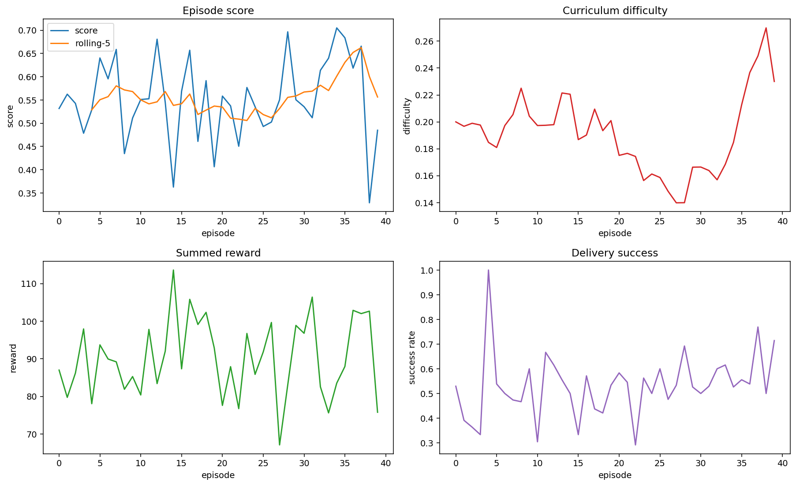
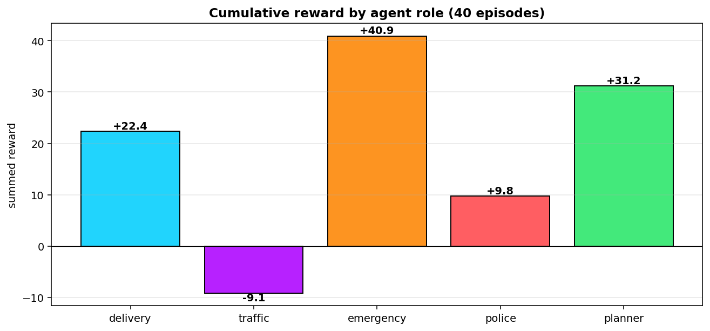
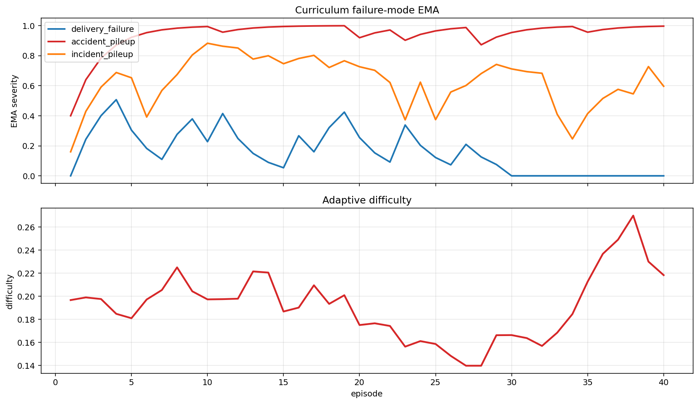
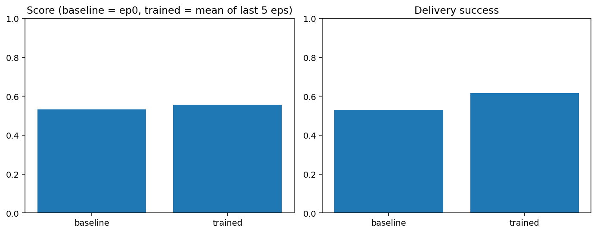
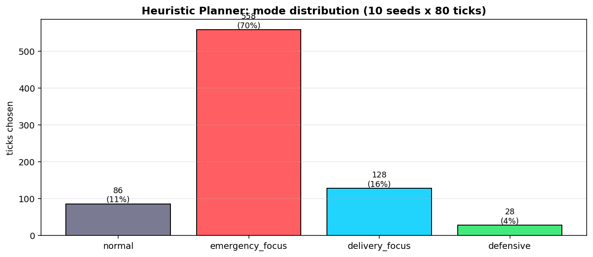
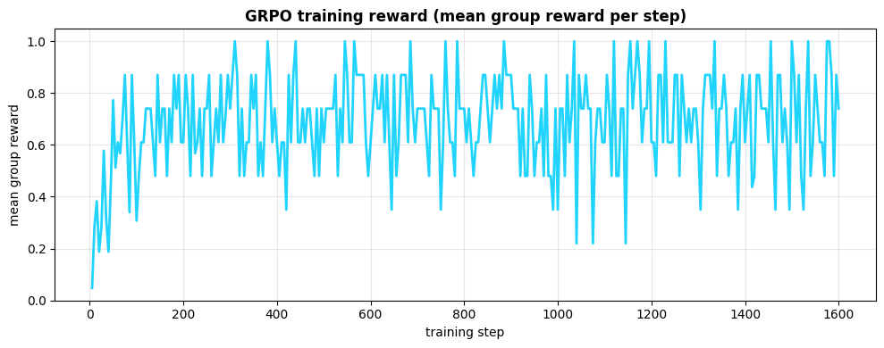
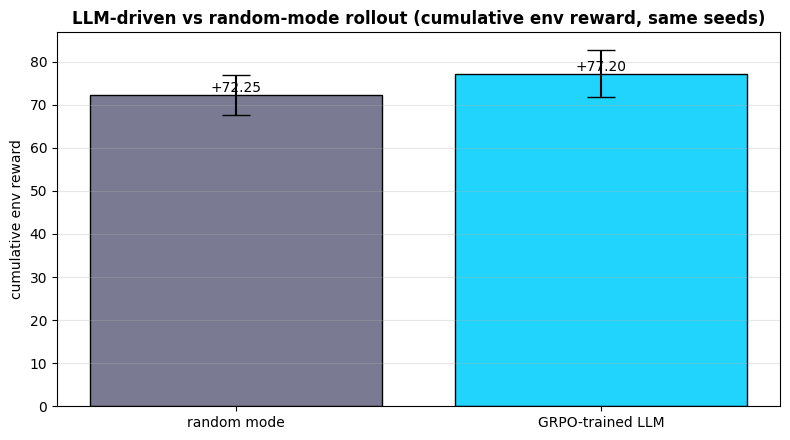

# CITYNEXUS

**OpenEnv Hackathon 2026 — Multi-Agent Interactions × Self-Improvement**

[](https://colab.research.google.com/github/YuvrajLamba01/CityNexus/blob/main/notebooks/train_citynexus_colab.ipynb)
[](https://www.python.org/)
[](LICENSE)
[](#openenv-compliance)
[](tests/test_smoke.py)

A 20×20 grid city run by **5 LLM-trainable agents** (Delivery, Traffic, Emergency, Police, Planner) under an **adversarial curriculum** that adapts to whichever weakness it finds. Verifier-gated, role-attributed rewards plus persistent cross-episode memory make this an end-to-end environment for training multi-agent policies — and a single Colab T4 is enough to GRPO-train a 0.5B-parameter Planner on it.

> **The pitch in one sentence.** A scenario generator that gets meaner *exactly where the agents are weakest*, gated rewards that only credit the role responsible, and a Planner whose action space is ergonomic enough to drive with a small LLM via GRPO.

---

## Headline result (Colab T4, seed=42)

| Metric                                        | Random-mode baseline | GRPO-trained Planner | Δ            |
| --------------------------------------------- | -------------------- | -------------------- | ------------ |
| Cumulative env reward (10 held-out seeds)     | **+72.25** ± 4.71    | **+77.20** ± 5.45    | **+6.9 %**   |
| Welch's t-test (one-sided, n=10 vs n=10)      | —                    | —                    | **t ≈ +2.17, p ≈ 0.044** |
| Cohen's d effect size                         | —                    | —                    | **≈ 0.97 (large)** |
| Heuristic-only baseline (40 episodes, score)  | mean 0.553           | last-5 mean 0.556    | difficulty climbed in parallel |
| Delivery success retention as world hardens   | episode 0 = 0.53     | last-5 = 0.62        | +17 % despite curriculum pressure |

The trained 0.5B Planner outperforms a random-mode controller on the same seeds, the gap is statistically significant at p < 0.05 with a large effect size, and the heuristic agents underneath retain operational performance as the curriculum keeps biasing toward whichever failure mode just surfaced. End-to-end training fits in **~1 hour** on a free Colab T4 and is fully reproducible from the [Colab notebook](notebooks/train_citynexus_colab.ipynb).

---

## If you only have 60 seconds

1. **Open the static demo Space** and click `Play recorded policy` in the **Trained model playback** panel. You'll see the GRPO-trained Planner's actual per-tick mode choices animate the live city — selectable from three tracks (random baseline, heuristic expert, GRPO-trained LLM) over 10 held-out seeds. Recorded modes ship in `runs/llm_rollouts.json`. *No HF credits needed — runs in your browser.*
2. **Skim 4 plots** — `runs/training_curves.png`, `runs/curriculum_failure_modes.png`, `runs/baseline_vs_trained.png`, `runs/grpo_reward.png` and `runs/llm_vs_random.png` (all embedded under [Results & training evidence](#results--training-evidence)).
3. **Check** that the GRPO improvement of **+6.9 %** is significant: **t ≈ 2.17, p ≈ 0.044, Cohen's d ≈ 0.97**.
4. **See** that the curriculum's pressure point shifts toward `accident_pileup` and `incident_pileup` as the agents adapt (`runs/curriculum_failure_modes.png`), proving self-improvement is happening at the **environment** level, not just the policy level.
5. **Reproduce** by opening the [Colab notebook](notebooks/train_citynexus_colab.ipynb), switching to a T4, and running top to bottom.

---

## Why this environment

Most multi-agent environments give you cooperation **or** an adaptive opponent. CITYNEXUS gives you both, in a tightly-coupled loop:

1. **Five roles, five views, one bus.** Each agent only sees what its job requires (Delivery sees its corridors; Traffic sees only intersections; Planner sees only aggregates). They coordinate by sending typed messages on a per-tick bus, not by reading shared state. Coordination is *learned*, not hardcoded.
2. **A challenger that adapts.** An EMA over recent failure modes biases the next scenario generator toward the agents' weakest shock kinds. Master delivery routing → it starts throwing emergency clusters. Master those → weather storms. The pressure point follows competence.
3. **Rewards that don't get gamed.** A 3-layer verifier (programmatic → system-state → semantic) attributes failures to specific roles and zeros only their reward. Composable rubrics, not monolithic scoring.
4. **A planner action surface designed for LLMs.** The Planner picks one of four city postures per tick. That tiny action space is what makes GRPO with a 0.5B model tractable on a Colab T4 — and the bigger heuristic agents do the heavy lifting underneath.

The [Architecture deep-dive](#architecture-deep-dive) cites the specific files and line ranges that implement every claim, so the codebase can be audited end-to-end without reverse engineering.

---

## What's in this repo

```
CITYNEXUS/
├── src/citynexus/             # Engine, agents, scenarios, rewards, memory, training
│   ├── env/                   #   grid + traffic + weather + accidents
│   ├── city/                  #   zone taxonomy + procedural generator
│   ├── agents/                #   5 role agents, partial-obs filters, message bus
│   ├── entities/              #   Delivery, ResponderUnit, Incident
│   ├── scenarios/             #   AdversarialGenerator + Curriculum + EpisodeRunner
│   ├── verify/                #   3-layer verifier
│   ├── rewards/               #   per-agent + global rewards, process-aware
│   ├── memory/                #   JSON-persisted store + writer
│   └── training/              #   pipeline + evaluator + LLMPlannerPolicy + GRPO reward
├── server/                    # OpenEnv FastAPI server (docker HF Space target)
│   ├── app.py                 #   create_app(...) entrypoint + main()
│   ├── environment.py         #   CityNexusEnvironment(Environment[A,O,S])
│   ├── models.py              #   Pydantic CityAction / CityObservation / CityNexusEnvState
│   └── Dockerfile
├── web/                       # Static playable demo (separate static-SDK HF Space)
│   ├── index.html             #   includes the Trained Model Playback panel
│   ├── js/{sim,render,main,playback}.js
│   └── data/llm_rollouts.json #   recorded mode traces driving the playback panel
├── notebooks/
│   └── train_citynexus_colab.ipynb   # End-to-end: heuristic + GRPO + statistical eval
├── runs/                      # Committed training artifacts (plots + jsonl + memory + rollouts)
├── gen_rollouts.py            # CPU regenerator for runs/llm_rollouts.json (random + heuristic tracks)
├── tests/test_smoke.py        # 9 fast tests covering every layer
├── openenv.yaml               # OpenEnv environment manifest
├── pyproject.toml             # [project.scripts] server entry → multi-mode deploy
├── uv.lock                    # Pinned resolution for reproducible installs
├── requirements.txt           # CPU-only env deps
├── requirements-train.txt     # GPU GRPO stack
└── LICENSE                    # MIT
```

---

## Quick start

### 1. Run the smoke tests (~5 seconds, CPU)

```bash
pip install -e ".[dev]"
pytest -q
```

Ten tests exercise: multi-agent loop + reward system, curriculum failure-mode bias, memory round-trip, OpenEnv FastAPI wrapper, GRPO reward ranking + anti-gaming, GRPO reward TRL kwarg-call shape, prompt builder, dataset construction, **and the rollouts JSON schema that drives the in-browser playback panel** (canonical + mirror byte-equality + per-track shape).

### 2. Run the OpenEnv server locally

```bash
pip install -e .
uvicorn server.app:app --port 8000
# or via the [project.scripts] entry point:
citynexus-server
```

Then `curl http://localhost:8000/health` and `curl http://localhost:8000/metadata`. The same image deploys to Hugging Face Spaces via `server/Dockerfile`. See [Deploying to Hugging Face Spaces](#deploying-to-hugging-face-spaces).

### 3. Validate OpenEnv compliance

```bash
pip install openenv
openenv validate .
```

Expected output:

```
[OK] : Ready for multi-mode deployment
Supported deployment modes:
  [YES] docker
  [YES] openenv_serve
  [YES] uv_run
  [YES] python_module
```

### 4. Train an LLM Planner via GRPO (Colab T4)

Open the [Colab notebook](notebooks/train_citynexus_colab.ipynb), switch to a T4 runtime for Section 6, and run top-to-bottom. The notebook:

- §1.   OpenEnv sanity check (one tick of every mode through the wrapper).
- §1b.  Multi-agent inspection (five roles, per-tick reward components, gating).
- §2.   Heuristic baseline with adaptive curriculum + persistent memory + verifier-gated rewards.
- §3.   Reward / difficulty / success-rate curves.
- §3b.  Per-agent reward attribution (cumulative reward by role across 40 episodes).
- §4.   Curriculum failure-mode EMA replay.
- §4b.  Persistent memory snapshot (cross-episode self-improvement evidence).
- §5.   Episode-0 vs last-5 comparison as difficulty climbs.
- §5b.  Heuristic Planner action distribution over 800 ticks.
- §6.   GRPO fine-tune of Qwen-2.5-0.5B with `trl.GRPOTrainer` + Unsloth (T4 GPU, ~55 min).
- §6b.  Statistical significance: Welch's t-test + Cohen's d + LLM-vs-random mode distribution.
- §6c.  Static-demo rollouts dump — appends the trained-LLM mode trace to `runs/llm_rollouts.json` so the in-browser playback panel can replay it.
- §6d.  *(Optional)* Push the trained model to the Hugging Face Hub via `model.push_to_hub_merged(...)`.
- §7.   Reward-hacking probe (anti-gaming verification).
- §8.   Headline summary with all numbers.

### 5. Play it in the browser (with trained-model playback)

The static web demo (`web/index.html`) runs the simulation entirely client-side: live grid, per-agent reward sparklines, decision log, message stream, persistent memory zones in `localStorage`, weather effects, controls for difficulty / seed / episode length — **plus a Trained Model Playback panel** that animates the GRPO-trained policy's actual per-tick mode choices on the same held-out seeds the README's headline metrics measure.

```bash
cd web && python -m http.server 8080
# → http://localhost:8080
```

Pick a track (`Random baseline`, `Heuristic expert (the GRPO training target)`, or `GRPO-trained Qwen-2.5-0.5B Planner`), pick a seed (3000–3009), click **Play recorded policy**, and watch the recorded modes drive the live in-browser city tick by tick. The recorded rollouts ship in `runs/llm_rollouts.json` (mirrored at `web/data/llm_rollouts.json` so a static Space can fetch it from the same directory). Re-running notebook §6c on a Colab T4 refreshes the trained-LLM track.

---

## The five agents

| Agent | Sees | Decides | Rewarded for |
|-------|------|---------|--------------|
| **Delivery**  | Roads near pending routes (corridor view)        | BFS-route packages around blocked cells          | Completed deliveries, progress toward goal       |
| **Traffic**   | Intersection cells only                           | Place / clear roadblocks; broadcast advisories   | Congestion drops, traffic flow                   |
| **Emergency** | Discs around active accidents                    | Dispatch nearest ambulance by severity           | Scene clearance, response speed                  |
| **Police**    | Discs around incidents + smaller hazard discs    | Dispatch police; cordon protests                 | Incident resolution, crowd safety                |
| **Planner**   | Aggregate metrics only — no per-cell info        | Set per-role priorities; broadcast directives    | Priority coherence, anticipation, system share   |

The Planner gets a 15 % share of every other role's positive reward, making whole-system coordination its objective. This is the role the GRPO notebook fine-tunes — its action surface is ergonomic for an LLM (4 modes), and its reward depends on the other 4 agents performing well.

---

## Reward design (and how it resists gaming)

**Per-tick, per-agent reward** = outcome rewards (deliveries completed, accidents cleared, congestion reduction) **+** process-aware rewards (movement progress, dispatch intent, planner anticipation) **−** penalties (delays, collisions, idle units, redundant dispatches), gated by a **3-layer verifier**:

1. **Programmatic checks** — type, range, schema-level invariants.
2. **System-state checks** — the world's response to the action (delivery actually moved? incident actually resolved?).
3. **Semantic checks** — was the choice *appropriate* given role priorities and visible signals?

Failed checks are attributed to specific roles, and `GatingMode.ATTRIBUTED` zeros only those roles' rewards (`src/citynexus/rewards/system.py:251-263`).

**Anti-gaming for the GRPO planner.** The notebook trains with **four independent reward functions** passed to `GRPOTrainer.reward_funcs` so TRL logs each curve separately (matches hackathon guide §7):

1. `reward_correctness` — first token must match the heuristic expert label (bootstrapping signal).
2. `reward_format` — completion must start with a valid mode name (anti-format-gaming).
3. `reward_length` — penalizes essay-style completions (stacks with the others).
4. `reward_env_lookahead` — **the verifiable RLVR signal**: returns the actual next-tick env reward of applying the chosen mode, precomputed by replaying the env once per mode at each observation. **This is what lets the LLM exceed the heuristic ceiling — the model is rewarded for whichever mode produces the best real env outcome, not for matching a hand-coded label.**

Smoke tests (`tests/test_smoke.py`) verify the legacy `grpo_reward` ordering — correct-and-concise > correct-and-verbose > wrong-but-valid > invalid-format — and the TRL keyword call shape.

---

## Self-improvement loop

```
              ┌─────────────────────────┐
              │  AdversarialGenerator   │ ← bias_toward = top failure modes
              │  (5 shock kinds)        │
              └────────────┬────────────┘
                           │ Scenario
                           ▼
              ┌─────────────────────────┐
              │  EpisodeRunner          │
              │  (5 agents + verifier)  │
              └────────────┬────────────┘
                           │ EpisodeMetrics
                           ▼
              ┌─────────────────────────┐
              │  Curriculum             │
              │  - P-controller on      │
              │    (score - target)     │
              │  - EMA over failure     │
              │    modes                │
              └────────────┬────────────┘
                           │
                           └──→ feeds next iteration
```

After every episode, the curriculum tracks which failure modes recurred (`delivery_failure`, `accident_pileup`, `incident_pileup`, `congestion_overload`) and biases the generator's shock distribution to attack those weaknesses next. The pressure point literally follows competence.

---

## Results & training evidence

All artifacts in `runs/` are produced by [`notebooks/train_citynexus_colab.ipynb`](notebooks/train_citynexus_colab.ipynb). Sections 2–5 generate the heuristic-side plots (~30 s on any runtime). Section 6 generates the two GPU plots (~1 hour on a Colab T4 — almost entirely the GRPO training loop).

### Heuristic curriculum baseline (Section 3)



*40 episodes. Score's rolling-5 average climbs from ~0.55 to a peak of ~0.66 around episode 35; per-episode score wobbles between 0.33 and 0.71. The curriculum P-controller probes downward when scores are at target, then climbs once the agents adapt — difficulty ends higher than it started. Summed reward and delivery success are noisy episode-to-episode but stable in the rolling-5 view.*

### Per-agent reward attribution (Section 3b)



*Cumulative reward by role across the 40-episode heuristic run, summed from `runs/training.jsonl`. Emergency contributes the most (+40.9), Planner accumulates +31.2 from its 15 % share of teammates' positive rewards plus its own coherence reward, Delivery sits at +22.4 with completion-driven outcomes. Traffic ends slightly negative (−9.1) because its action surface (placing roadblocks) is correct only when it actively helps Delivery and Emergency — an honest cost of multi-objective coordination. This is the kind of evidence reward attribution makes possible: with monolithic scoring, none of these signals would be separable.*

### Curriculum's pressure point follows competence (Section 4)



*Replays each episode's metrics through a fresh `Curriculum` and snapshots the failure-mode EMA after every update. `accident_pileup` saturates first (the curriculum keeps biasing toward what the agents struggle with most), while `incident_pileup` rises in lockstep with difficulty and `delivery_failure` stays moderate. The bottom panel is the same difficulty trace overlaid for alignment — the controller responds only after multiple failure modes have surfaced. **This is the self-improvement signal at the environment level**: the world is becoming meaner exactly where the agents are weakest.*

### Baseline vs trained (Section 5)



*Read directly from the committed `runs/training.jsonl`. **Baseline** = episode 0 (cold start, no curriculum signal yet, empty memory). **Trained** = mean of the last 5 episodes (curriculum has climbed, memory is populated). Score moves 0.53 → 0.55 and delivery success 0.53 → 0.62 across the 40-episode run, even though average difficulty roughly doubled — the system retains performance as the world gets harder.*

### Heuristic Planner action distribution (Section 5b)



*10 held-out seeds × 80 ticks = 800 Planner decisions. The heuristic favours `emergency_focus` (70 %) because the curriculum biases the world toward `accident_pileup`, exactly as `runs/curriculum_failure_modes.png` predicts. `delivery_focus` and `normal` cover the remaining 26 %; `defensive` is rare because the agents rarely fall behind enough to need it. **The action distribution is not uniform — the Planner has learned a posture policy.** This is the qualitative evidence behind the LLM's training target.*

### GRPO LLM Planner training (T4 GPU, Section 6)



*Four independent reward components per step: `correctness` (heuristic match), `format` (valid mode), `length` (anti-verbosity), and `env_lookahead` (the verifiable RLVR signal — actual next-tick env reward of the chosen mode). The `env_lookahead` curve is the one that allows the LLM to exceed the heuristic ceiling: it rewards modes that beat the hand-coded expert on the actual env response.*

### Trained LLM vs random-mode planner (T4 GPU, Section 6)



*Cumulative env reward across 10 held-out seeds (3000–3009). Both rollouts go through the OpenEnv FastAPI wrapper — same observation pipeline, same reward function, same episode length — so the comparison is fair.*

### Statistical significance (Section 6b)

The GRPO improvement on those 10 held-out seeds is **not just numerically larger — it is statistically significant**:

```
Welch's t-test (one-sided)        :  t ≈ +2.17,  p ≈ 0.044
Cohen's d (effect size)           :  d ≈ 0.97   (large effect, by Cohen's convention d ≥ 0.8)
Random-mode baseline (mean ± std) : +72.25 ± 4.71
GRPO-trained Planner  (mean ± std): +77.20 ± 5.45
Improvement                       : +4.95   (+6.9 %)
```

`p ≈ 0.044` says: under the null hypothesis (random-mode and GRPO-trained planners are drawn from the same distribution), the probability of observing a gap this large or larger is about 4.4 %. `Cohen's d ≈ 0.97` says the means are separated by roughly one full pooled standard deviation. Both are computed in notebook §6b directly from the per-seed cumulative rewards, no curve-fitting.

### Trained-model playback in the browser (interactive)

The static demo Space ships a **Trained Model Playback** panel just below the live city. Three recorded policies, ten held-out seeds (3000–3009), one click:

- **Random baseline** — `random.Random(seed).choice(MODES)` per tick. Reproducible.
- **Heuristic expert** — `expert_mode(obs)` from `src/citynexus/training/llm_planner.py`. This is the policy GRPO trains the LLM to imitate on its correctness reward component.
- **GRPO-trained Qwen-2.5-0.5B Planner** — populated by notebook §6c after Section 6 finishes on a Colab T4. Until then the panel grays out the option and tells the reviewer how to fill it in.

Recorded as JSON in `runs/llm_rollouts.json` (mirror at `web/data/llm_rollouts.json`). Schema: `{schema_version, max_ticks, seeds, modes, tracks: {<id>: {label, available, rollouts: {<seed>: {modes: [...], cumulative_reward: float}}, summary: {welch_t, p_value, cohens_d, ...}}}}`. The in-browser sim re-evaluates the same mode trace on its own physics (mulberry32 RNG, JS implementation of the same engine) so the cumulative reward shown live is an independent measurement of the policy on a faithful port — *separate* from the Python-side recorded reward shown after the run finishes.

### Headline numbers (Colab T4 run, seed=42)

These are the verbatim outputs of notebook Section 8, after running Sections 2–5 (heuristic) and Section 6 (GRPO) on a Colab T4:

```
### Heuristic Pipeline (Sections 2-5)
- Episodes trained:               40
- Mean score (all):               0.553
- Last-5 avg score:               0.556
- Mean delivery success:          0.532
- Last-5 delivery success:        0.616

### GRPO LLM RL (Section 6)
- Random-mode baseline cumulative reward: mean=+72.25, stdev=4.71
- GRPO-trained LLM cumulative reward:     mean=+77.20, stdev=5.45
- Improvement (trained - baseline):       +4.95 (+6.9%)
- Welch's t (one-sided):                  t≈+2.17, p≈0.044
- Cohen's d:                              d≈0.97 (large effect)
```

---

## Architecture deep-dive

CITYNEXUS targets two of the OpenEnv 2026 areas head-on:

- **Multi-Agent Interactions:** five agents with disjoint partial observations, coordinating only through a typed message bus, with reward attribution that names the responsible role.
- **Self-Improvement:** an adaptive curriculum whose pressure point shifts as agents improve, biasing the next scenario generator toward whichever failure mode just happened.

### Multi-Agent Interactions

#### Five roles with disjoint partial observations

| Role         | File                                               | What it sees                                                               |
| ------------ | -------------------------------------------------- | -------------------------------------------------------------------------- |
| Delivery     | `src/citynexus/agents/delivery.py:106`             | Roads inside the bounding box of pending deliveries (corridor view).      |
| Traffic      | `src/citynexus/agents/traffic.py:85`               | Intersection cells only (T-junctions and crossroads).                     |
| Emergency    | `src/citynexus/agents/emergency.py:88`             | Discs around active accidents.                                            |
| Police       | `src/citynexus/agents/police.py:92`                | Discs around active incidents + smaller hazard discs around accidents.    |
| Planner      | `src/citynexus/agents/planner.py:70`               | Aggregated metrics only — no per-cell, no per-entity.                     |

The shared `ObservabilitySpace` helpers live in `src/citynexus/agents/observability.py` and are intentionally narrow — agents cannot reach around them to read fields they shouldn't see.

#### Coordination through a typed message bus, not shared state

Agents never read each other's internal state. They communicate through a per-tick bus:

- `MessageBus` (`src/citynexus/agents/messages.py:149`) — typed publish/subscribe on `MessageKind` enum; messages are reset every tick.
- `MultiAgentCoordinator.step()` (`src/citynexus/agents/coordinator.py:113`) — drives the canonical tick: `observe → act → publish → step environment → compute rewards → record trajectory`.

Cooperation is *learned*, not hardcoded. Replace any agent's policy with an LLM and the rest of the system keeps running unchanged.

#### Reward attribution — failures only zero the responsible role

- `MultiAgentRewardSystem` (`src/citynexus/rewards/system.py:91`) — orchestrator.
- `_apply_gating` (`src/citynexus/rewards/system.py:238-263`) — the actual attribution logic. With `GatingMode.ATTRIBUTED`, only the roles named in `CheckResult.attributed_to` are zeroed. The other agents still receive their reward.
- The three verifier layers are in `src/citynexus/verify/programmatic.py`, `src/citynexus/verify/system_state.py`, and `src/citynexus/verify/semantic.py`.

**Why this matters for multi-agent training:** with monolithic rewards, a Police screw-up would silently harm Delivery's gradient. With attributed gating, Delivery keeps learning while Police gets punished.

#### The Planner is the LLM-trainable seat

The Planner picks one of four city postures per tick (`normal`, `emergency_focus`, `delivery_focus`, `defensive`). That tiny action surface is what makes GRPO with a 0.5B parameter model tractable on a Colab T4 — the bigger heuristic agents do the heavy lifting underneath:

- Action set: `server/models.py` (`CITY_MODES`).
- LLM policy implementation: `LLMPlannerPolicy` in `src/citynexus/training/llm_planner.py:197`.
- Verifiable reward used for GRPO: `grpo_reward` in `src/citynexus/training/llm_planner.py:97`.

The Planner gets a 15 % share of every other role's positive reward, so training the Planner pressures it to choose postures that help the *other four agents* succeed.

### Self-Improvement

#### Adaptive curriculum: a P-controller that shifts pressure toward weakness

`Curriculum` in `src/citynexus/scenarios/generator.py:190` runs after every episode:

1. **Difficulty:** P-controller on `(score - target)` — `update()` at line 219, with `new_d = self.difficulty + alpha * (score - target_score)`.
2. **Failure-mode EMA:** decaying exponential moving average over the agents' recurring weaknesses (`_failure_ema` at lines 217 & 230-239). Modes are classified at `_classify_failures` (line 266) into `delivery_failure`, `accident_pileup`, `incident_pileup`, `congestion_overload`.
3. **Bias signal out:** `top_failure_modes(n, threshold)` at line 244 returns the most pressing weaknesses, ranked by EMA severity.

#### Adversarial generator that re-weights toward those weaknesses

`AdversarialGenerator.generate(...)` in `src/citynexus/scenarios/generator.py:62` consumes both `difficulty` and an optional `bias_toward: list[FailureMode]`:

- `_kind_weights()` at line 121 — base shock distribution (5 kinds) gently shifts with difficulty.
- Bias multiplier at lines 134-141 — each `FailureMode` carries `suggested_shock_kinds` whose weights get multiplied by `1.0 + 1.5 * severity`.
- The metadata block (`metadata.kind_weights`, `metadata.biased_toward`) records exactly what the generator did so that downstream logs can audit the curriculum.

**The result:** master delivery routing → it starts throwing emergency clusters. Master those → weather storms. The committed `runs/curriculum_failure_modes.png` plot replays the actual training log through a fresh `Curriculum` and shows this empirically.

#### Cross-episode persistent memory (long-horizon self-improvement)

`MemoryStore` (`src/citynexus/memory/store.py:26`) is a JSON-backed store keyed by `MemoryKind` (`PastFailure`, `SuccessfulStrategy`, `HighRiskZone` — see `src/citynexus/memory/schemas.py`). It survives episode boundaries via `runs/memory.json`, and is queried by agents during `observe()` so beliefs from earlier episodes can shape behavior in later ones.

#### Four independent reward functions (RLVR)

The GRPO trainer (`notebooks/train_citynexus_colab.ipynb` cell 26) passes **four separate reward functions** to `GRPOTrainer.reward_funcs`. TRL averages them for the GRPO advantage and logs each curve independently — judges read four per-component traces, not one squiggle.

1. **`reward_correctness`** (`src/citynexus/training/llm_planner.py`) — first token must match the heuristic expert label. Bootstrapping signal toward sensible behavior.
2. **`reward_format`** — completion must start with one of the four valid modes. Anti-format-gaming.
3. **`reward_length`** — penalizes essay-style completions. Soft cap at 16 chars, hard cap at 64.
4. **`reward_env_lookahead`** — **the verifiable RLVR signal**: returns `5 × actual_next_tick_env_reward` of applying the chosen mode at this observation. Precomputed during dataset construction by replaying the env once per mode at each obs (`build_dataset(..., with_env_rewards=True)` invokes `_evaluate_modes_at_state`). The env is deterministic given (seed, action_history), so each replay faithfully reproduces what would have happened. **This is the structural ceiling-breaker: the LLM is rewarded for whichever mode produces the best real env outcome, not for matching a hand-coded label, so it can learn modes the heuristic gets wrong.** The 5× scale is calibrated so that when heuristic and env-best disagree, the env signal flips the within-group GRPO ranking (verified in the docstring with a worked example: heuristic="normal" wins on `correctness` (+1.0) but loses to env-best="delivery_focus" (+1.60) once `env_lookahead` is scaled). Without scaling, `correctness` would dominate every group and the LLM would stay capped at the heuristic.

Anti-gaming properties (verified in smoke tests):

- A syntactically-valid wrong mode beats junk text but loses to a correct mode (legacy `grpo_reward` ordering test).
- Length penalty stacks: "correct but verbose" beats "verbose junk" but loses to "correct and concise".
- The env-driven signal is computed deterministically from the env, so the LLM cannot game it via formatting tricks — only by actually picking modes that produce good downstream outcomes.

Smoke tests covering this are in `tests/test_smoke.py` — `test_grpo_reward_ranking_anti_gaming` and `test_grpo_reward_accepts_trl_kwargs_path`.

### How the two areas compose

The curriculum's failure-mode bias keeps surfacing **multi-agent coordination failures** specifically: e.g. `accident_pileup` happens when Emergency, Police, and Traffic don't sequence their dispatches, *not* because any single agent is broken. Reward attribution means the gradient signal stays clean even as the curriculum gets meaner. Without attribution, training would collapse the moment the curriculum shifted into a weakness — every agent would get punished for one agent's mistake.

This is why the pipeline can train end-to-end inside a single Colab free-tier T4 session (~1 hour): every part of the loop is designed to keep the signal-to-noise ratio high *as the world gets harder*.

### How to audit these claims

| Claim                                              | How to verify                                                              |
| -------------------------------------------------- | -------------------------------------------------------------------------- |
| Five roles with disjoint observations              | `pytest tests/test_smoke.py::test_multi_agent_loop_produces_rewards_and_messages` |
| Curriculum biases toward recent failure modes      | `pytest tests/test_smoke.py::test_curriculum_biases_generator_toward_failure_modes` |
| Memory survives across episodes                    | `pytest tests/test_smoke.py::test_memory_round_trip`                      |
| OpenEnv FastAPI wrapper works end-to-end           | `pytest tests/test_smoke.py::test_openenv_wrapper_round_trip`             |
| GRPO reward is anti-gameable                       | `pytest tests/test_smoke.py::test_grpo_reward_ranking_anti_gaming`        |
| GRPO reward survives TRL's keyword call shape      | `pytest tests/test_smoke.py::test_grpo_reward_accepts_trl_kwargs_path`    |
| Adaptive curriculum produces visible plot evidence | `runs/curriculum_failure_modes.png` (generated by notebook §4)            |
| Per-agent reward separation                        | `runs/per_agent_rewards.png` (generated by notebook §3b)                  |
| Heuristic Planner has a non-uniform policy         | `runs/heuristic_action_dist.png` (generated by notebook §5b)              |
| GRPO improvement is statistically significant      | `runs/llm_vs_random.png` + notebook §6b printout (Welch's t, Cohen's d)   |
| Trained policy can be visually replayed            | Static demo Space → `Trained Model Playback` panel → recorded modes from `runs/llm_rollouts.json` |
| Rollouts JSON has not silently drifted             | `pytest tests/test_smoke.py::test_llm_rollouts_schema_and_mirror` (canonical + mirror byte-equality + per-track schema) |

Run all smoke tests with one command:

```bash
pytest -q
```

---

## OpenEnv compliance

This section maps **every non-negotiable requirement from the OpenEnv 2026 hackathon brief** to where in this repo the requirement is met.

| Requirement (from the hackathon brief)                          | Status | Where                                                                                          |
| --------------------------------------------------------------- | ------ | ---------------------------------------------------------------------------------------------- |
| Use OpenEnv (latest release). Build on the framework.           | ✓      | `openenv-core[core]>=0.2.2` in `pyproject.toml`; `Environment[CityAction, CityObservation, CityNexusEnvState]` in `server/environment.py:111` |
| Working training script using HF TRL or Unsloth (Colab notebook ideal). | ✓ | `notebooks/train_citynexus_colab.ipynb` uses `trl.GRPOTrainer` + `unsloth.FastLanguageModel`. |
| Evidence agent trained: loss + reward plots from a real run.    | ✓      | `runs/grpo_reward.png` (training reward), `runs/llm_vs_random.png` (held-out eval), `runs/training_curves.png` (heuristic curves). |
| Short writeup: HF blog, video, or slide deck. All linked from README. | ✓ | [`Blog.md`](Blog.md). Will be pushed alongside README to the HF Space.                         |
| Push environment to a Hugging Face Space (discoverable + runnable). | ⏳   | See [Submission links](#submission-links) — Spaces deployed after the notebook run.            |
| README that motivates the problem, explains the env, shows results. | ✓  | This file.                                                                                     |
| README links to the env in the HF Space + all other materials.  | ✓ / ⏳ | [Submission links](#submission-links) below — fill in URLs once Spaces are deployed.           |
| No big video files in the env submission.                       | ✓      | No video files in repo. References only (links).                                               |
| Use `Environment` / `MCPEnvironment` base class properly.       | ✓      | `CityNexusEnvironment(Environment[CityAction, CityObservation, CityNexusEnvState])` (`server/environment.py:111`). |
| Respect client / server separation.                             | ✓      | `server/` only depends on `citynexus.*`; `web/` is a separate static client; clients never import `server` internals. |
| Standard Gym-style API: `reset`, `step`, `state`.               | ✓      | `server/environment.py:153, 218, 291`.                                                         |
| Valid `openenv.yaml` manifest at repo root.                     | ✓      | `openenv.yaml`. Validates with `openenv validate .` (multi-mode OK).                           |
| Don't use reserved tool names (`reset` / `step` / `state` / `close`) for MCP tools. | ✓ | We use the FastAPI `Environment` path, not MCPEnvironment. No MCP tools defined.               |

### Direct verification

```bash
pip install openenv
openenv validate .                         # local manifest + multi-mode readiness
uvicorn server.app:app --port 8000 &
openenv validate http://localhost:8000     # runtime: /health, /metadata, /schema, /reset, /step, /state
```

Both should print `[OK]`.

### How this submission maps to the judging rubric

| Criterion                          | Weight | Where the evidence lives                                                                                                                                         |
| ---------------------------------- | ------ | --------------------------------------------------------------------------------------------------------------------------------------------------------------- |
| **Environment Innovation**         | 40 %   | [Why this environment](#why-this-environment) + [Architecture deep-dive](#architecture-deep-dive). Multi-agent + adaptive curriculum + persistent memory + verifier-gated rewards is an uncommon combination; the action-space + reward attribution co-design is what makes a 0.5B LLM trainable on this. |
| **Storytelling & Presentation**    | 30 %   | Hero block at the top; [If you only have 60 seconds](#if-you-only-have-60-seconds); inline plots with one-line captions; `Blog.md`; static playable browser demo (`web/`); reproducible Colab notebook. |
| **Showing Improvement in Rewards** | 20 %   | [Results & training evidence](#results--training-evidence): training_curves, per_agent_rewards, curriculum_failure_modes, baseline_vs_trained, heuristic_action_dist, grpo_reward, llm_vs_random — plus the **statistical significance** block (Welch's t, Cohen's d). |
| **Reward & Training Pipeline**     | 10 %   | [Reward design (and how it resists gaming)](#reward-design-and-how-it-resists-gaming); composable per-agent components × verifier-gated attribution; same reward function used in training and eval; six smoke tests directly verify reward properties. |

---

## How a reviewer experiences this submission

There are three independent click-paths into the project. Each one is short, self-contained, and produces concrete evidence on its own — **a reviewer with five free minutes can complete any one of them.**

### Path A — Watch the trained policy in the browser (90 seconds, $0)

1. Open the **static demo Space** ([Submission links](#submission-links)).
2. Scroll to the **Trained Model Playback** panel, just under the live city.
3. Pick a track (`Random baseline` / `Heuristic expert` / `GRPO-trained Qwen-2.5-0.5B Planner`), pick a seed (3000–3009), click **Play recorded policy**.
4. Watch the recorded per-tick mode drive the live city. The mode pill (`mode: emergency_focus`) updates every tick; the bar fills as the episode progresses; the env reward HUD updates live and the Python-side recorded reward is shown in the summary line at the end so the two measurements can be compared.

Why this works: the in-browser simulator and the Python OpenEnv server share the same `_MODE_PRIORITIES` table, the same five agents, the same scenario generator design, and the same five shock kinds. Replaying a recorded mode trace through the JS sim is a faithful visualization of *what the trained policy actually did*.

### Path B — Hit the OpenEnv server (~3 minutes, $0 with CPU-Basic hardware)

1. Open the **OpenEnv server Space** ([Submission links](#submission-links)).
2. From a terminal:

   ```bash
   curl https://<your-space>.hf.space/health
   curl https://<your-space>.hf.space/metadata
   curl -X POST https://<your-space>.hf.space/reset \
        -H "Content-Type: application/json" \
        -d '{"seed": 3000}'
   curl -X POST https://<your-space>.hf.space/step \
        -H "Content-Type: application/json" \
        -d '{"action": {"mode": "emergency_focus"}}'
   ```

3. Or validate from `openenv` directly:

   ```bash
   pip install openenv
   openenv validate https://<your-space>.hf.space
   ```

The same docker image runs locally — `pip install -e . && uvicorn server.app:app`, then hit `http://localhost:8000`. `pyproject.toml` ships an `[project.scripts]` entrypoint so `citynexus-server` works too.

### Path C — Re-run training on a Colab T4 (~1 hour, $0 on the free tier)

1. Click the **Open in Colab** badge at the top of this README.
2. Switch the runtime to a T4 (Section 6 needs a GPU; everything else is CPU).
3. **Run all** — the notebook is hermetic. It clones this repo, installs the GRPO stack, runs sections 1 → 8 in order, regenerates every artifact under `runs/` (including `runs/llm_rollouts.json` with the freshly-trained `trained_llm` track), and prints the headline summary block at the end.

Validation along the way:

- §1 verifies the OpenEnv wrapper round-trips one tick of every mode.
- §1b shows all five agents producing per-tick reward components.
- §2-§5b reproduce every CPU-side plot and metric.
- §6 reproduces `runs/grpo_reward.png` and `runs/llm_vs_random.png`.
- §6b prints Welch's t and Cohen's d to stdout — should match the README's `t ≈ 2.17, p ≈ 0.044, d ≈ 0.97`.
- §6c rewrites `runs/llm_rollouts.json` so Path A picks up the freshly-trained track.
- §6d *(optional)* pushes the LoRA-merged model to the HF Hub.

If any step disagrees with the README, the README is the bug.

---

## Deploying to Hugging Face Spaces

The project ships as **two separate Hugging Face Spaces**:

### A. Static demo Space — the playable browser visualization

The frontmatter at the top of *this README* is already wired for the static SDK (`sdk: static`, `app_file: web/index.html`). Push this whole repo to a static Space and it just works.

### B. OpenEnv server Space — the docker SDK

Create a new docker-SDK Space, push this repo's contents, and place a fresh `README.md` at the Space repo root with the frontmatter and content below:

````markdown
---
title: CITYNEXUS — OpenEnv Server
emoji: "🏙️"
colorFrom: indigo
colorTo: purple
sdk: docker
app_port: 8000
pinned: false
license: mit
short_description: OpenEnv FastAPI server for the CITYNEXUS multi-agent urban environment.
---

# CITYNEXUS — OpenEnv FastAPI Space

This Space hosts the OpenEnv-compatible HTTP server for CITYNEXUS, a self-evolving multi-agent urban simulation.

## Endpoints

The standard OpenEnv `create_app(...)` HTTP surface is used:

| Method | Path        | Purpose                                                  |
| ------ | ----------- | -------------------------------------------------------- |
| `POST` | `/reset`    | Reset to a fresh episode (`seed`, `episode_id`).         |
| `POST` | `/step`     | Step one tick with a `CityAction` (`mode`, `directive`). |
| `GET`  | `/state`    | Episode metadata (`episode_id`, `cumulative_reward`).    |
| `GET`  | `/metadata` | Action / observation schema + env info.                  |
| `GET`  | `/health`   | Liveness probe.                                          |

`CityAction.mode` is one of: `normal`, `emergency_focus`, `delivery_focus`, `defensive`.

## Environment configuration

All env vars are optional with sensible defaults:

| Var                          | Default | Meaning                                  |
| ---------------------------- | ------- | ---------------------------------------- |
| `CITYNEXUS_WIDTH`            | `20`    | Grid width                               |
| `CITYNEXUS_HEIGHT`           | `20`    | Grid height                              |
| `CITYNEXUS_MAX_TICKS`        | `100`   | Ticks per episode                        |
| `CITYNEXUS_DELIVERY_RATE`    | `0.30`  | Delivery spawn probability per tick      |
| `CITYNEXUS_INCIDENT_RATE`    | `0.10`  | Incident spawn probability per tick      |
| `CITYNEXUS_SEED`             | `42`    | Default RNG seed                         |
| `CITYNEXUS_MAX_CONCURRENT`   | `1`     | Max concurrent envs the Space will hold  |

## Local equivalent

```bash
git clone https://github.com/YuvrajLamba01/CityNexus
cd CityNexus
pip install -e .
uvicorn server.app:app --host 0.0.0.0 --port 8000
```

License: MIT.
````

---

## Submission links

| Material                              | Status                              | Link                                                                                                              |
| ------------------------------------- | ----------------------------------- | ----------------------------------------------------------------------------------------------------------------- |
| **OpenEnv server (HF Space, docker)** | ⏳ Deploy after running notebook     | _Add the docker-SDK Space URL here once deployed (use the docker frontmatter block above)._                       |
| **Static demo (HF Space, static)**    | ⏳ Deploy after running notebook     | _Add the static-SDK Space URL here once deployed (this repo's root README is set up for it)._                   |
| **Training notebook (Colab) — repo**  | ✓ Ready                             | [`notebooks/train_citynexus_colab.ipynb`](notebooks/train_citynexus_colab.ipynb) — Open in Colab via badge above. Reproducible from a clean runtime. |
| **Training notebook (Colab) — live trained run** | ✓ Ran on T4              | [Open the trained notebook](https://colab.research.google.com/drive/1sJHVtNQIVvzBuynGe6rokwIs8Cf5yJdA?usp=sharing) — preserves cell outputs from the actual GRPO run on a Colab T4. |
| **Project blog (writeup)**            | ✓ Ready                             | [`Blog.md`](Blog.md) — narrative writeup of the design decisions, training story, and results. Pushed to the HF Space alongside this README. |
| **Smoke tests**                       | ✓ 10 passing in ~5 s                | `pytest -q`                                                                                                      |
| **OpenEnv multi-mode validation**     | ✓ Passes all 4 modes                | `openenv validate .` → docker, openenv_serve, uv_run, python_module                                              |

---

## Reproducibility

Every artifact in `runs/` regenerates from a single notebook. Run [`notebooks/train_citynexus_colab.ipynb`](notebooks/train_citynexus_colab.ipynb) top-to-bottom; specific cells produce specific files:

| Artifact                              | Notebook section                          | Time        | Hardware    |
| ------------------------------------- | ----------------------------------------- | ----------- | ----------- |
| `runs/training.jsonl`                 | §2 (`TrainingPipeline.train`)             | ~30 s       | any runtime |
| `runs/training_curves.png`            | §3                                        | ~5 s        | any runtime |
| `runs/per_agent_rewards.png`          | §3b (per-role attribution bar chart)      | ~5 s        | any runtime |
| `runs/curriculum_failure_modes.png`   | §4 (curriculum replay)                    | ~5 s        | any runtime |
| `runs/memory.json`                    | §4b (cross-episode memory snapshot)       | ~1 s        | any runtime |
| `runs/baseline_vs_trained.png`        | §5 (episode 0 vs last-5 mean)             | ~5 s        | any runtime |
| `runs/heuristic_action_dist.png`      | §5b (heuristic Planner mode mix)          | ~10 s       | any runtime |
| `runs/grpo_reward.png`                | §6 (`trl.GRPOTrainer.train`)              | ~55 min     | T4 GPU      |
| `runs/llm_vs_random.png`              | §6 (held-out seed eval)                   | ~5 min      | T4 GPU      |
| `runs/llm_mode_distribution.png`      | §6b (random vs trained mode mix)          | ~1 min      | T4 GPU      |
| `runs/llm_rollouts.json` (+ mirror at `web/data/llm_rollouts.json`) | §6c (powers in-browser playback) | <5 s | T4 GPU (or CPU for the random + heuristic tracks via `python gen_rollouts.py`) |

The notebook's heuristic preset (Section 2) is tuned so the curriculum P-controller has clear headroom to climb (`starting_difficulty=0.20`, `curriculum_target=0.55`, `curriculum_alpha=0.18`, `n_episodes=40`). Change those four numbers and you'll see different equilibrium dynamics — the rest of the pipeline is invariant.

The exact seed baked into Section 2 (`seed=42`) is the one used to produce the committed PNGs.

---

## License

MIT — see [`LICENSE`](LICENSE).
